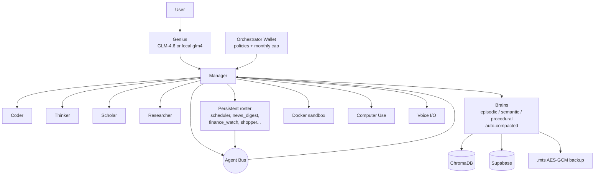

# Metis Command

**Local-first autonomous AI desktop. Five-agent swarm, persistent memory, policy-gated autonomy — every byte on your hardware.**

[](https://github.com/om1o/Metis_Command/actions/workflows/ci.yml)

Metis is a Claude.ai / Codex-style desktop AI that orchestrates a swarm of specialists on top of local Ollama models — with an optional GLM-4.6 "Genius" brain over the Z.ai API. Memory persists across sessions via ChromaDB + Supabase. Skills are forged on demand and executed inside a Docker sandbox. Voice and computer-use tools let Metis hear you and drive your desktop.

---

## Quickstart — one command

```powershell
# Windows
.\metis.bat

# Any OS
python launch.py
```

First run takes 5–15 minutes (venv, pinned deps, Ollama models, opens the desktop window). Subsequent runs start in ~3 seconds.

Flags:

| Flag              | Effect                                           |
|-------------------|--------------------------------------------------|
| `--tier Lite`     | Tiny models only (~4 GB). Good for laptops.      |
| `--tier Pro`      | Default. Balanced daily driver (~12 GB).         |
| `--tier Sovereign`| Everything, including GLM + vision (~35 GB).     |
| `--skip-models`   | Don't pull any Ollama models this run.           |
| `--no-window`     | Headless — UI served at http://127.0.0.1:8501.   |
| `--reset`         | Nuke the venv + setup stamp and start over.      |

If you don't have Ollama yet, `launch.py` detects it, prints the download link, and opens Metis anyway in cloud-only mode (GLM / OpenAI). Install Ollama from https://ollama.com/download and re-run to enable local brains.

## Architecture



## Features

### Genius brain
GLM-4.6 via Z.ai (set `GLM_API_KEY` in `.env`) with automatic fallback to local `glm4:9b` through Ollama. Cloud calls auto-bill through the Wallet so spend is always capped.

### Brains — memory that never forgets
Swappable long-term memory profiles, each with three tiers:

- **Episodic** — every chat turn (persisted by `memory_loop.persist_turn`)
- **Semantic** — durable facts distilled by the nightly synthesizer + manually-pinned notes
- **Procedural** — step recipes the swarm has learned

When a brain crosses its token budget, the Thinker compresses the oldest entries into higher-level facts. Crucially: nothing is deleted without passing a sanity gate, and source entries are moved to `identity/brains/<slug>/compact_trash.jsonl` with 30-day retention **before** deletion — so even a compaction failure never loses data.

### Orchestrator Wallet
Every cloud API call, plugin purchase, and subagent summon charges against a policy-gated wallet with a monthly cap. Categories: `cloud_api`, `plugin`, `subagent`, `compute`, `data`, `other`. Policies can deny outright, cap per-day, or require approval above a threshold. Simulated by default; flip `METIS_WALLET_MODE=stripe_issuing` + `STRIPE_ISSUING_KEY` to attach a real virtual card.

### Agent roster + bus
12 data-driven specialists (`identity/roster.json`) — scheduler, inbox_triage, news_digest, shopper, finance_watch, fitness_coach, calendar_planner, home_automation, code_reviewer, security_auditor, designer, travel_agent. Start one as a long-running inbox worker with `agent_roster.spawn_persistent(slug)`. Agents talk to each other through `agent_bus` (thread-safe publish/inbox with built-in channels `morning_briefing`, `alerts`, `handoff`, `approvals`); every message is audit-logged.

### Daily plan
`scheduler.seed_default_schedules()` installs three opinionated jobs:

| Action                   | Schedule           | What it does                                     |
|--------------------------|--------------------|--------------------------------------------------|
| `daily_briefing`         | 07:00 local        | Writes `artifacts/daily_plan_YYYY-MM-DD.md`      |
| `nightly_brain_compact`  | 02:00 local        | Folds oldest entries in every brain              |
| `weekly_brain_backup`    | Sundays 03:00      | Exports every brain to `identity/backups/`       |

Set `DAILY_PLAN_EMAIL` to have the briefing also emailed.

### Reliability guarantees

- **Local auth**: every `/wallet`, `/brains`, `/agents` route requires `Authorization: Bearer <token>`. Token is per-install, generated on first boot, stored 0600 in `identity/local_auth.token`. CORS is locked to `127.0.0.1` / `localhost`.
- **Cross-process file locking**: `wallet.json`, `schedules.json`, and every brain's collection use a cross-platform advisory lock (msvcrt on Windows, fcntl elsewhere) so the UI and API bridge can never corrupt each other's state.
- **Bounded mission pool**: `METIS_MAX_WORKERS` (default 3) + `METIS_MAX_QUEUE` (default 24). Excess submissions raise `PoolFull` instead of DoSing Ollama.
- **Cancellable streams + tools**: stream reads time out at `METIS_STREAM_READ_TIMEOUT` (default 60s), autonomous-loop tools at `METIS_TOOL_TIMEOUT_S` (default 120s). Stop button actually stops.
- **Data-loss-safe compaction**: see the Brains section above.

## API

FastAPI bridge on `:7331` (default). All routes except `/`, `/health`, `/version`, `/status` require the local bearer token.

```bash
# Fetch once - surface the token in the UI's Developer expander too.
TOKEN=$(cat identity/local_auth.token)

curl http://127.0.0.1:7331/version
curl http://127.0.0.1:7331/status
curl -H "Authorization: Bearer $TOKEN" http://127.0.0.1:7331/wallet
curl -H "Authorization: Bearer $TOKEN" http://127.0.0.1:7331/brains
curl -H "Authorization: Bearer $TOKEN" http://127.0.0.1:7331/agents
```

## Keyboard shortcuts

| Keys                  | Action                     |
|-----------------------|----------------------------|
| `Ctrl+Space`          | Toggle Metis window        |
| `Ctrl+K`              | Command palette            |
| `Ctrl+Shift+N`        | New chat                   |
| `Ctrl+Enter`          | Send message               |
| `Esc`                 | Stop generation            |
| `Ctrl+/`              | Shortcuts cheat sheet      |
| `Ctrl+B`              | Toggle sidebar             |
| `Ctrl+J`              | Toggle artifacts pane      |
| `Ctrl+M`              | Push-to-talk (mic)         |

## Slash commands

`/code` · `/plan` · `/search` · `/skill` · `/sandbox` · `/remember` · `/forget` · `/model` · `/screenshot` · `/speak` · `/click`

## Testing

```powershell
# Fast unit tests (isolated sandbox for every test)
python -m pytest tests/unit

# Full end-to-end smoke walk (imports through every major subsystem)
python -m tests.smoke

# Lint
ruff check .
```

## Website + releases

The marketing + download site lives in [`site/`](site/). Deploys to Vercel in one command:

```powershell
cd site
npx vercel --prod
```

Releases are packaged by:

```powershell
python scripts\package_metis.py --version 0.16.4
gh release create v0.16.4 dist\metis-command-windows.zip dist\SHA256.txt `
    --title "Metis Command v0.16.4" `
    --notes "Release notes..."
```

The site's `/api/download` endpoint 302-redirects to the latest GitHub Release asset, so publishing a new release automatically updates the download link.

## Pre-commit hooks

```powershell
pip install pre-commit
pre-commit install
# runs on every git commit:
#   - trailing whitespace / EOF / YAML-TOML-JSON validation
#   - ruff auto-fix
#   - secret scan (safety.secret_scan) over staged files
```

## Files

| File                      | Purpose                                           |
|---------------------------|---------------------------------------------------|
| `launch.py` + `metis.bat` | One-command launcher (bootstrap + services + window) |
| `brain_engine.py`         | Tri-Core dispatcher + streaming + role routing    |
| `swarm_agents.py`         | 5-agent CrewAI swarm + Genius                     |
| `subagents.py`            | One-shot specialist subagent spawner              |
| `agent_roster.py`         | Persistent 12-agent roster + worker threads       |
| `agent_bus.py`            | Thread-safe inter-agent message bus               |
| `crew_engine.py`          | Hierarchical mission runner with event stream     |
| `autonomous_loop.py`      | Plan/Execute/Reflect loop with cancel + timeouts  |
| `concurrency.py`          | Bounded mission pool                              |
| `brains.py`               | Swappable long-term memory profiles               |
| `memory_loop.py`          | 4 Pillars wired together                          |
| `memory_vault.py`         | ChromaDB-backed vault                             |
| `wallet.py`               | Orchestrator budget + policies + ledger           |
| `auth_local.py`           | Per-install bearer token                          |
| `safety.py`               | Audit / file_lock / secret-scan / PATHS roots     |
| `scheduler.py`            | Cron-like scheduler with seeded daily jobs        |
| `daily_tasks.py`          | daily_briefing / brain_compact / brain_backup     |
| `skill_forge.py`          | Registry + Docker sandbox + forge_skill           |
| `artifacts.py`            | Watchable artifact store                          |
| `marketplace.py`          | Plugin store + Stripe checkout                    |
| `subscription.py`         | Free / Pro / Enterprise gating                    |
| `mts_format.py`           | `.mts` AES-GCM proprietary backup                 |
| `api_bridge.py`           | FastAPI local bridge with token middleware        |
| `dynamic_ui.py`           | Streamlit UI (Gemini × Manus aesthetic)           |
| `ui_theme.py`             | Aurora theme + reusable components                |
| `providers/glm.py`        | Z.ai / Zhipu GLM-4.6 adapter                      |
| `providers/stripe_issuing.py` | Real virtual-card adapter (opt-in)           |
| `scripts/bootstrap.py`    | Stdlib-only first-run setup                       |
| `scripts/desktop_shell.py`| pywebview native-window wrapper                   |
| `scripts/updater.py`      | Auto-update checker against GitHub releases       |
| `scripts/package_metis.py`| Release ZIP builder                               |
| `scripts/pre_commit_secret_scan.py` | Pre-commit hook backend                 |
| `site/`                   | Next.js 15 marketing + download site              |

## License

Proprietary — Metis Systems 2026. Security reports welcome at `security@metis.systems`.
